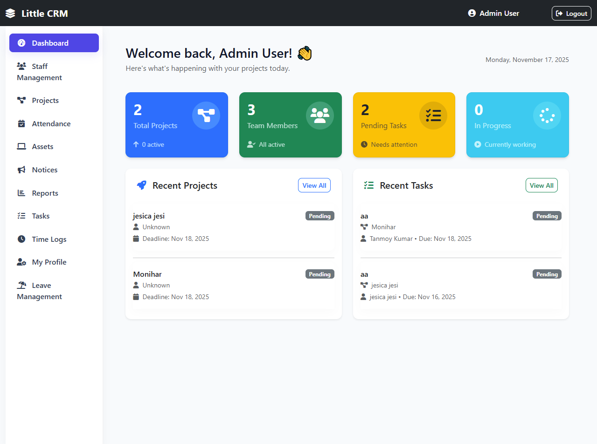
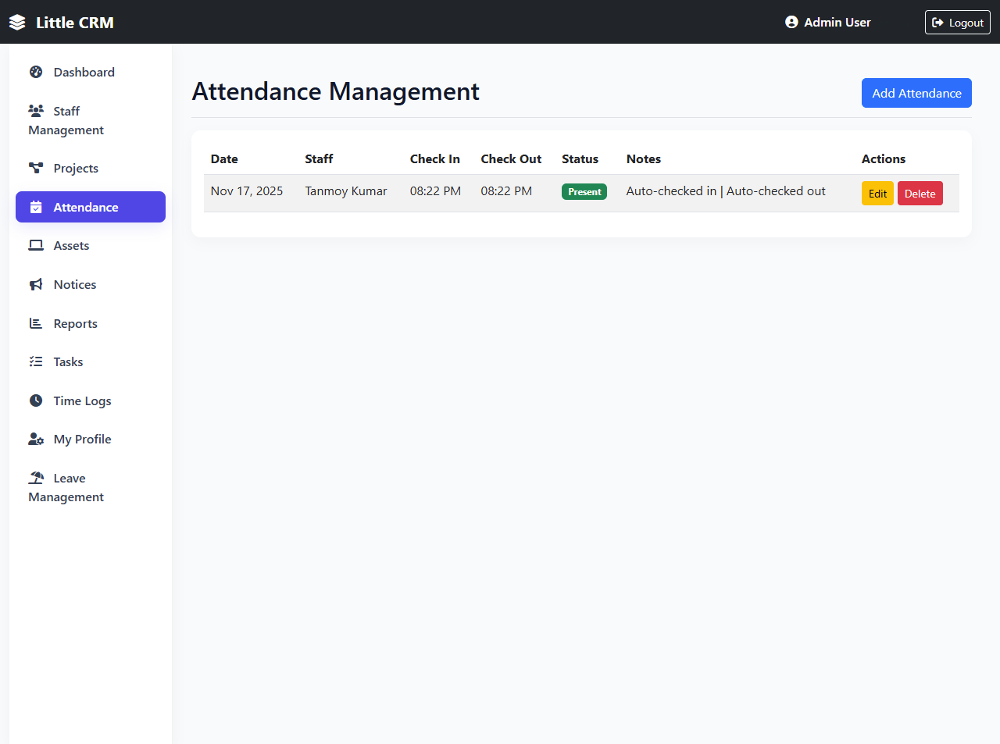
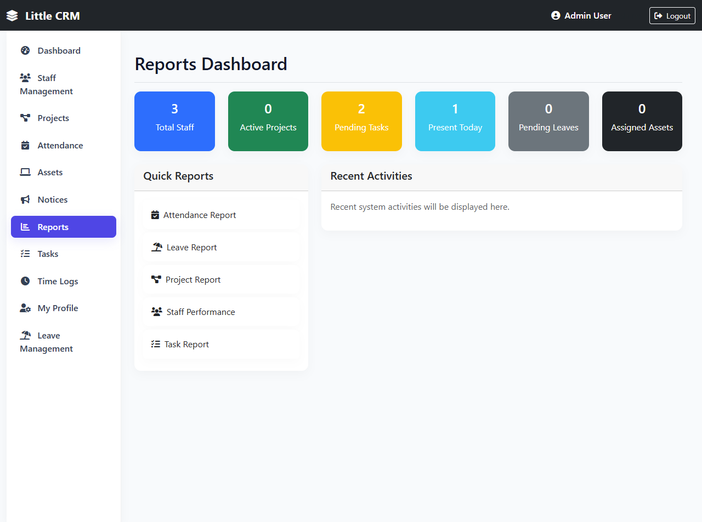
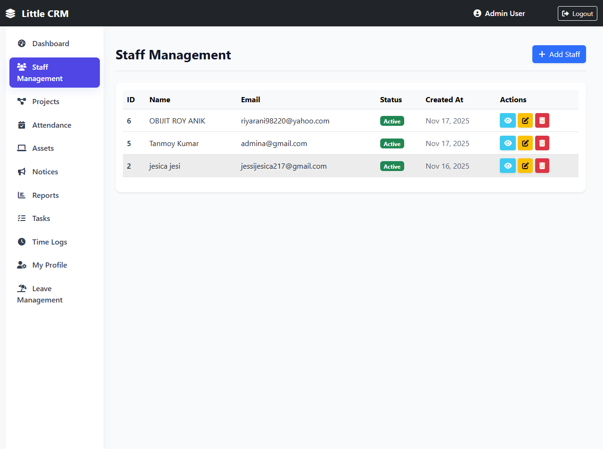
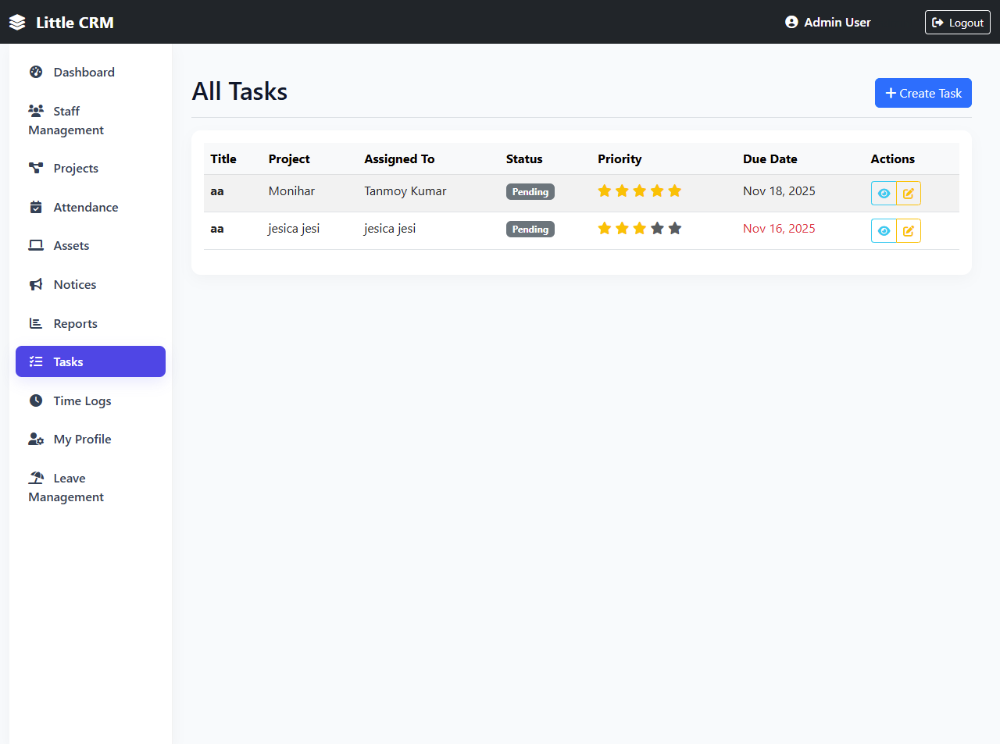
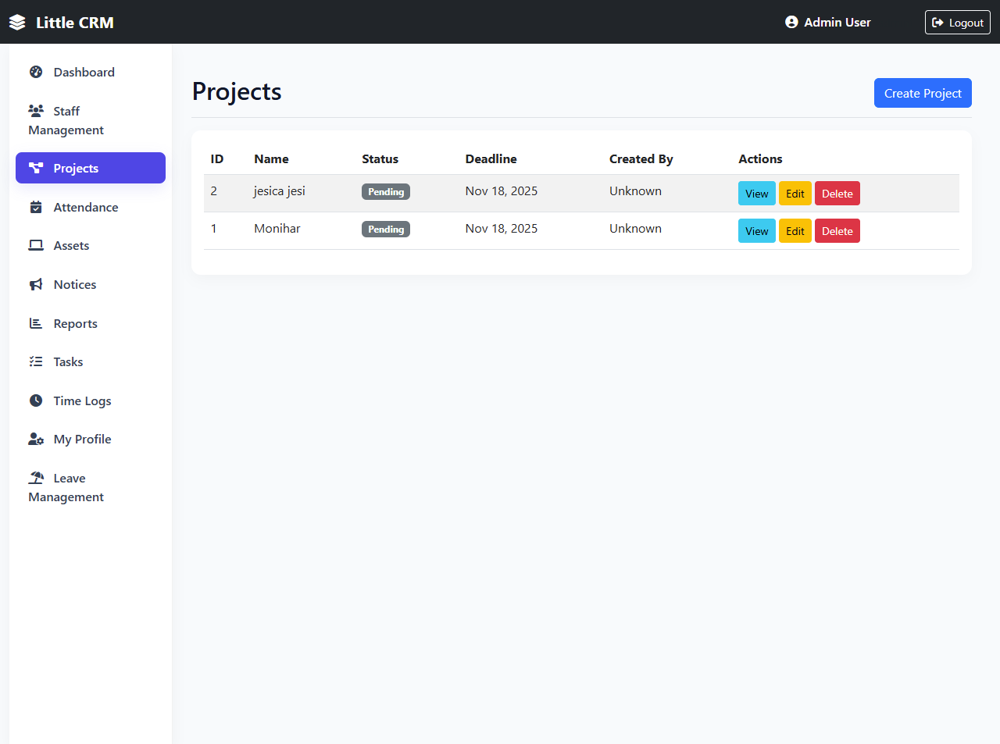
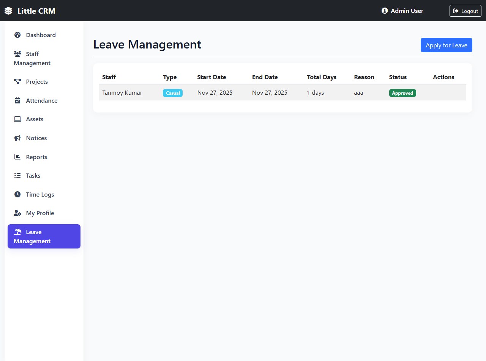
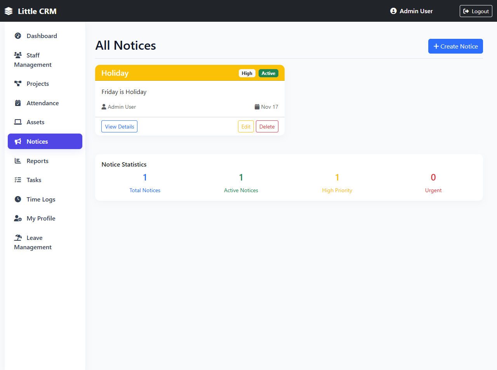
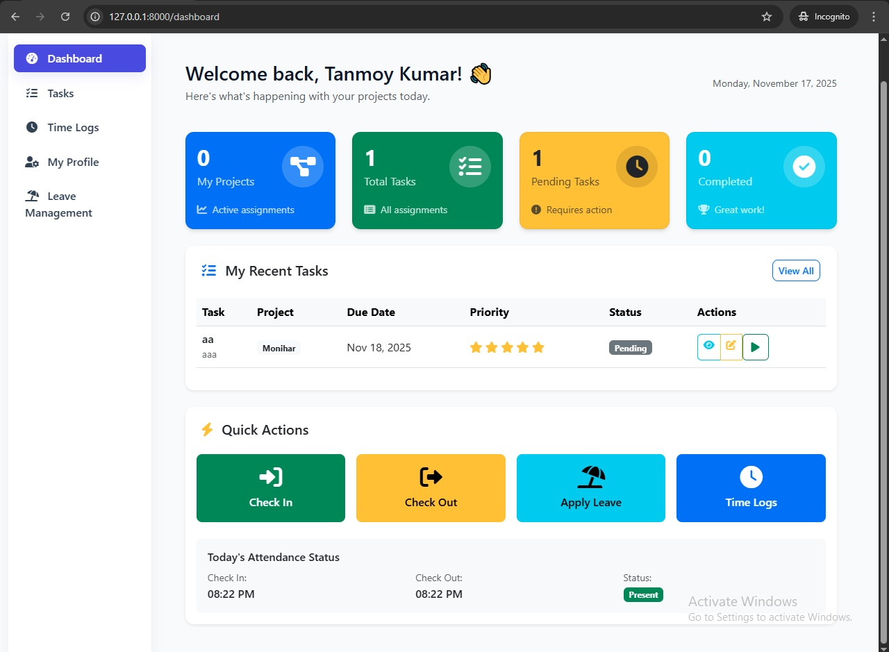

# 🌟 Little CRM – Laravel-Based Project & Task Management System

A powerful mini CRM system built using **Laravel & Bootstrap**, designed for small teams and organizations.  
This project includes complete Admin & Employee dashboards, task management, attendance tracking, leave management, project monitoring, and more.

---

# 📸 Screenshots

### Admin Dashboard









### Employee Dashboard


---

# 🚀 Features

### 👨‍💼 Admin Panel
- Manage projects  
- Assign tasks to employees  
- Track pending & completed tasks  
- Manage attendance  
- Approve/Reject leave requests  
- View reports  
- Post notices  
- Manage staff accounts  

### 👨‍🔧 Employee Panel
- View assigned tasks  
- Task status update  
- Apply for leave  
- Check In / Check Out (Attendance)  
- View time logs  
- Manage personal profile  

### 📁 Included Modules
- Project Management  
- Task Management  
- Attendance System  
- Time Logs  
- Leave Management  
- Notices  
- Staff Management  
- Profile Settings  

---

# 🛠 Tech Stack

| Technology | Usage |
|-----------|--------|
| **Laravel** | Backend Framework |
| **MySQL** | Database |
| **Bootstrap** | UI Styling |
| **Blade** | Template Engine |
| **Eloquent ORM** | Database Queries |

---

# 🔧 Installation & Setup

### 1. Clone the Repository
```bash
git clone https://github.com/YOUR_USERNAME/Little-CRM.git
cd Little-CRM

2. Install Dependencies
composer install
npm install
npm run build

3. Create Environment File
cp .env.example .env
php artisan key:generate


4. Configure Database
DB_DATABASE=little_crm
DB_USERNAME=root
DB_PASSWORD=

php artisan migrate --seed
